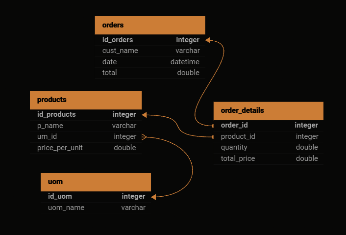

# Inventory Management System for Grocery Store

This project is a significant upgrade to a previous Python-based command line <a href = "https://github.com/009-KumarJi/stock-management">stock management program</a>, transforming it into a robust 3-tier grocery store inventory management system.

## Tech Stack

- **Frontend:** HTML, CSS (Bootstrap), JavaScript 
- **Backend :** Python Flask Server
- **Database:** MySQL 
- Used JQuery for AJAX requests and Bootstrap for styling. 
## Database Schema 

## Features

- View all products
- Add a new product
- Delete a product
