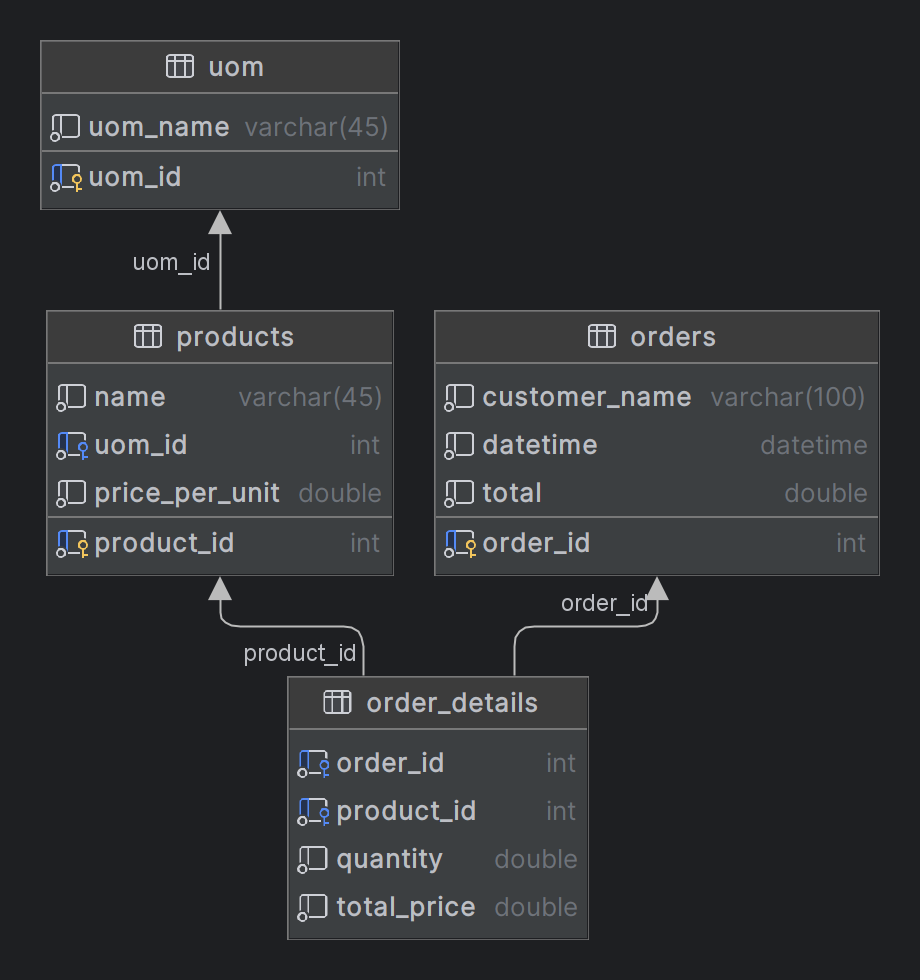

# Inventory Management System for Grocery Store

This project is a significant upgrade to a previous Python-based command line <a href = "https://github.com/009-KumarJi/stock-management">stock management program</a>, transforming it into a robust 3-tier grocery store inventory management system.

## Tech Stack

- **Frontend:** HTML, CSS (Bootstrap), JavaScript 
- **Backend :** Python Flask Server
- **Database:** MySQL 
- Used JQuery for AJAX requests and Bootstrap for styling. 
## Database Schema 



## Features

- View all products
- Add a new product
- Delete a product
- View all orders
- Place a new order

## Getting Started

These instructions will get you a copy of the project up and running on your local machine for development and testing purposes.

### Prerequisites

What things you need to install the software and how to install them:

- Python
- pip
- MySQL

### Installing

A step by step series of examples that tell you how to get a development environment running:

1. Create a new MySQL database and run the following SQL script to create the required tables:

```sql
create table orders
(
    order_id      int auto_increment
        primary key,
    customer_name varchar(100) not null,
    datetime      datetime     not null,
    total         double       not null
);

create table uom
(
    uom_id   int auto_increment
        primary key,
    uom_name varchar(45) not null
);

create table products
(
    product_id     int auto_increment
        primary key,
    name           varchar(45) not null,
    uom_id         int         not null,
    price_per_unit double      not null,
    constraint fk_um_id
        foreign key (uom_id) references uom (uom_id)
);

create table order_details
(
    order_id    int    not null,
    product_id  int    not null,
    quantity    double not null,
    total_price double not null,
    constraint fk_b_a
        foreign key (order_id) references orders (order_id)
            on update cascade on delete cascade,
    constraint fk_pid
        foreign key (product_id) references products (product_id)
);

create index fk_pid_idx
    on order_details (product_id);

create index fk_um_id_idx
    on products (uom_id);

```
2. Clone the repository to your local machine.
3. Navigate to the project directory.
4. Install the required Python packages using pip by running the following command:  ```bash pip install -r requirements.txt```


